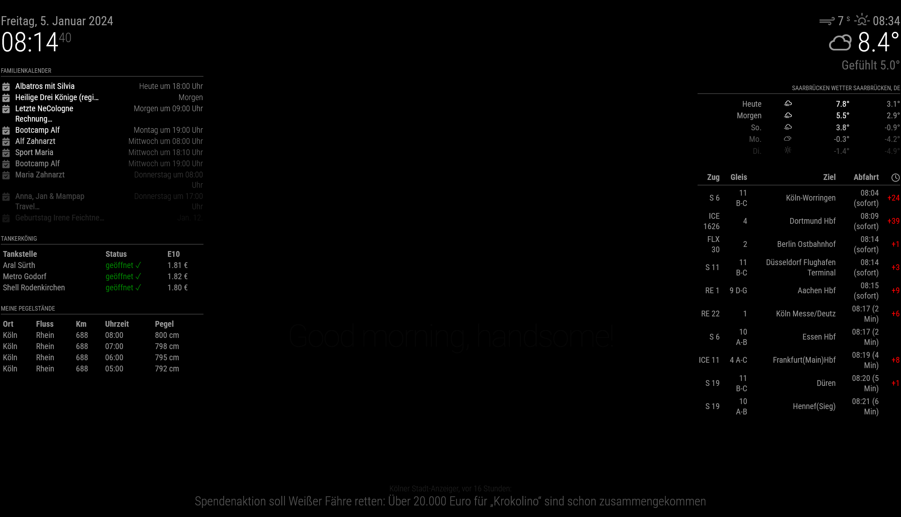

# MagicMirror² PegelAPI module
This is a module for `MagicMirror²`; the purpose of the module is to show you jokes from the PegelAPI.

## Installation
1.  Navigate into your MagicMirror's modules folder and execute git clone https://github.com/alfkoblischke/MMM-PegelAPI.git. A new folder will appear navigate into it.
2.  Edit your configuration file under `config/config.js` with the following configuration.
```
{
    module: 'MMM-PegelAPI',
    position: 'middle_center',
    config: {
        station: "a6ee8177-107b-47dd-bcfd-30960ccc6e9c" // stations at: https://www.pegelonline.wsv.de/gast/pegeltabelle
    }
}
```

### Preview



## Configuration options

| Option                 | Description
|------------------------|-----------
| `station`          | The list of station names can be found at: https://www.pegelonline.wsv.de/gast/pegeltabelle
| `fetchInterval`| How often (in milliseconds) a new water level should be fetched.<br><br> **Type:** `number` <br>**Default value:** `10 * 1000`


#### Credits
MagicMirror²:   [MagicMirror²](https://github.com/MichMich/MagicMirror)   
